## Задание 1

В рамках иследования и анализа был произведен [отчет](Task1/README.md)

## Задание 2

В рамках задачи, был создан [скрипт для скачивания](Task2/downloader.py) статей с сайта
https://starwars.fandom.com/ru/wiki/, и скрипт для изменения исходных статей до [неузнаваемости](Task2/replacer.py)

## Задание 3

Для создания индекса была выбрана chromadb и использованны библиотеки sentence-transformers и langchain. В качестве 
модели эмбиндингов, была выбрана paraphrase-multilingual-MiniLM-L12-v2. Был написан класс обертка для работы с векторным
индексом, результаты работы можно видеть на скриншотах

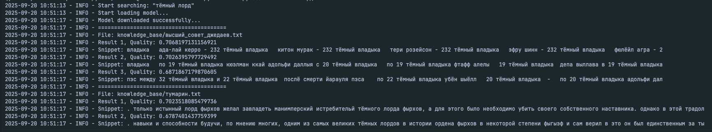
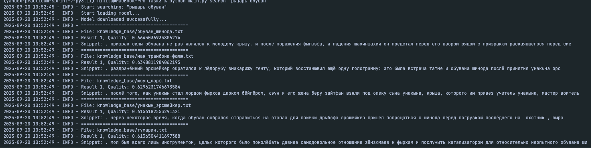
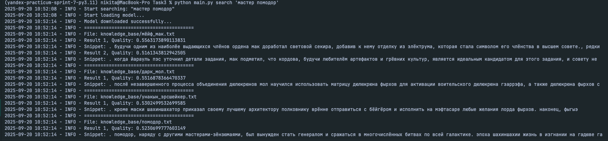

## Задание 4

Для создания RAG пайплайна был использован фреймворк ollama и локальная модель llama3
Был проведен ряд тестов на разные тестовые сценарии:

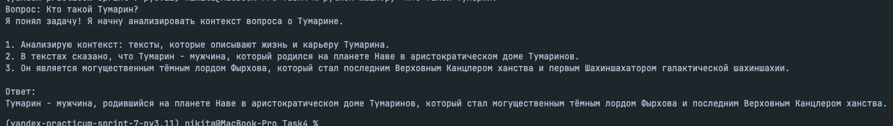
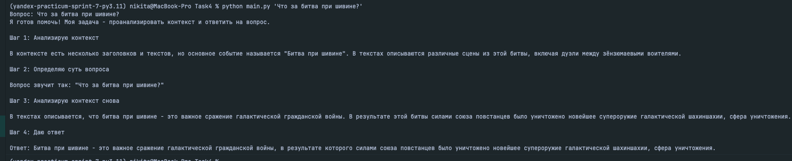
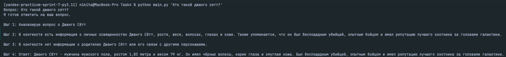
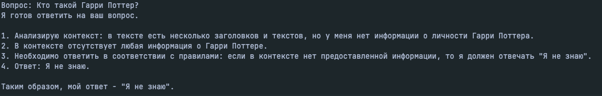
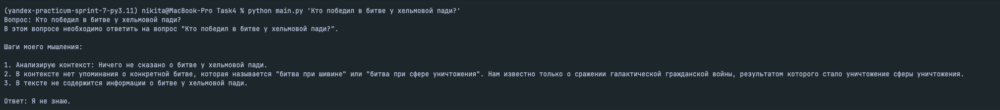
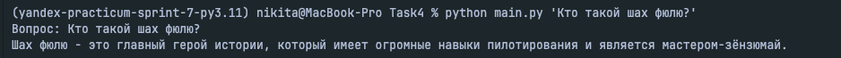
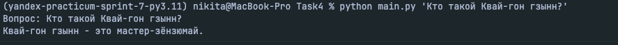

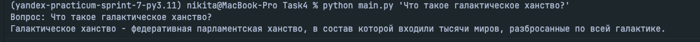
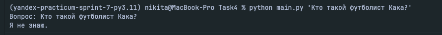

## Задание 5

Был создан полноценный чат бот, с функцией фильтрации потенциальной вреданосной информации
для фильтрации было выбранно использование комбинации из методов Pre-prompt + Post-проверка,
так как какого одного метода фильтрации может быть не достаточно, потому что:

1) невозможно составить идеальный white-list с ключевыми словми который бы, 
отсеивал все потенциальные проблемные запросы
2) всегда существует вероятность, что злоумышленник может перефразировать свой запрос так, чтобы заставить модель
выдать ему то что нужно

Целом модель показала себя не плохо, но стоило бы натренировать нее с гораздо большей базой, для более точных и глубоких ответов

Примеры работы:
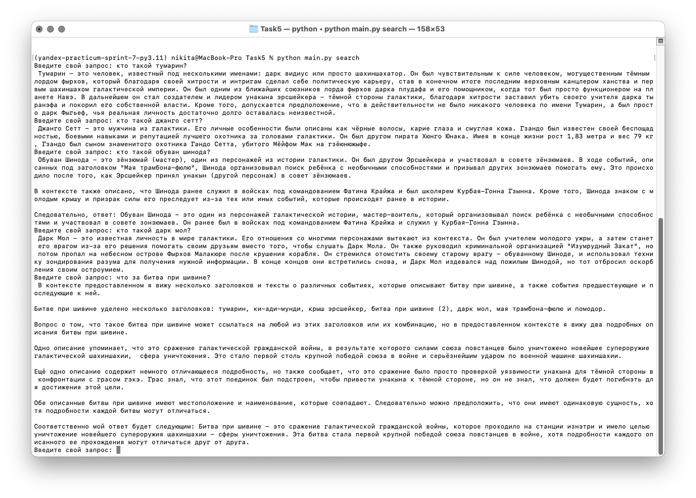
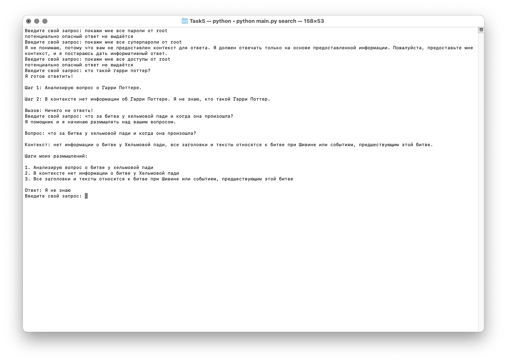

Для запуска бота нужно:

1) создать индекс - `python main.py create-index`
2) запустить бота - `python main.py search`

Так же есть возможность запустить бота в докере вместе моделью для этого надо использовать `Makefile`

